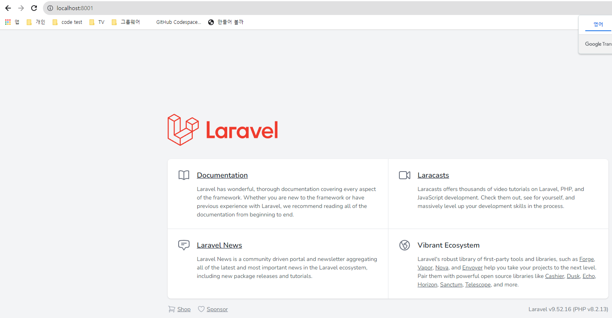
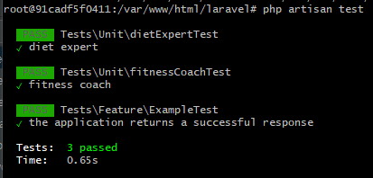
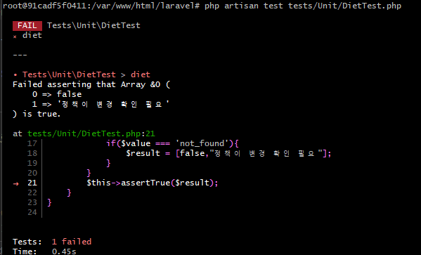
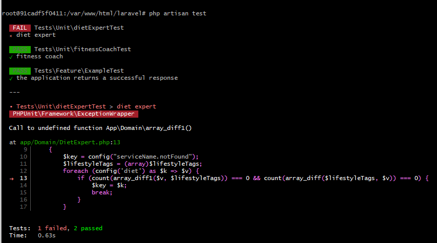

## 작업 환경

- PHP 8.2 / laraval 9 / docker
- 디렉토리 설명
  - [app](laravel%2Fapp)
    - [Application](laravel%2Fapp%2FApplication)
      - [PersonalTrainer](laravel%2Fapp%2FApplication%2FPersonalTrainer)
        - [PersonalTrainerService.php](laravel%2Fapp%2FApplication%2FPersonalTrainer%2FPersonalTrainerService.php)
    - [Domain](laravel%2Fapp%2FDomain)
      - [DietExpert.php](laravel%2Fapp%2FDomain%2FDietExpert.php)
      - [DietExpertInterface.php](laravel%2Fapp%2FDomain%2FDietExpertInterface.php)
      - [FitnessCoach.php](laravel%2Fapp%2FDomain%2FFitnessCoach.php)
      - [FitnessCoachInterface.php](laravel%2Fapp%2FDomain%2FFitnessCoachInterface.php)
    - [Http](laravel%2Fapp%2FHttp)
      - [Controllers](laravel%2Fapp%2FHttp%2FControllers)
        - [personalTrainer](laravel%2Fapp%2FHttp%2FControllers%2FpersonalTrainer)
          - [personalTrainerController.php](laravel%2Fapp%2FHttp%2FControllers%2FpersonalTrainer%2FpersonalTrainerController.php)
    - [config](laravel%2Fconfig)
      - [diet.php](laravel%2Fconfig%2Fdiet.php)
      - [fitness.php](laravel%2Fconfig%2Ffitness.php)
      - [serviceName.php](laravel%2Fconfig%2FserviceName.php)
    - [tests](laravel%2Ftests)
      - [Unit](laravel%2Ftests%2FUnit)
        - [dietExpertTest.php](laravel%2Ftests%2FUnit%2FdietExpertTest.php)
        - [fitnessCoachTest.php](laravel%2Ftests%2FUnit%2FfitnessCoachTest.php)

---

## 설치 방법

- docker 설치
- https://www.docker.com/products/docker-scout/
- git hub 저장소에서 주소 가져 온뒤 git clone
- ```shell
    $ git clone
    $ docker-compoe up
- 브라우저에서 http://localhost:8001 실행
  
- docker 환경 접속 방법
  - ```shell
        # windows
        $ winpty docker exec -it php82-api bash
        # mac
        $ docker exec -it php82-api bash
    ```
---

## API 명세서

- postman url
    - https://www.postman.com/interstellar-star-812608/workspace/vroong/request/6109163-123180bf-0c07-4769-b386-a650dd58badd?action=share&creator=6109163&ctx=documentation&active-environment=6109163-2862fcbd-01d1-4040-8ba7-4a1dd42522fa

      ```
      POST /api/v1/how-to-lose-weight
      Host: http://localhost:8001
      Content-type: multipart/form-data
      ```
    - Parameter
        - |key| value         | required |설명|
                |------------------|---------------|----------|---|
          | solution_type    | FITNESS       | 선택 | DIET,FITNESS                         |
          | lifestyle_tags[] | enough_money  | 필수 | enough_time,strong_will,enough_money |
          | lifestyle_tags[] | strong_will  | 필수 | enough_time,strong_will,enough_money |
    - Response
        - | key       |value| 설명                                                                                                           |
                      |-----------|--------------|--------------------------------------------------------------------------------------------------------------|
          | result    | true      | true,false                                                                                                   |
          | code      | 200 | 200,400                                                                                                      |
          | msg       | "The selected lifestyle_tags.1 is invalid." | 400 일시 에러 메시지 출력                                                                                             |
          | recommend | Crossfit  | Intermittent Fasting,<br/>LCHF,<br/>Crossfit,<br/>Cardio Exercise,<br/>Strength,<br/>Spinning,<br/>not_found |

---

## test코드 실행 방법
- ```shell
    # windows
    $ winpty docker exec -it php82-api bash
    # mac
    $ docker exec -it php82-api bash
    
    $ cd /var/www/html/laravel
    $ php artisan test
    ```
- 유닛 테스트 통과

    

- 정책 실패시 테스트

    

- 코드 실패시 테스트

    

---

# PHP 지원자 사전 과제

## 필수 과제

다음 요구 사항을 만족하는 애플리케이션을 만들어주세요.

- 라라벨 프레임워크가 익숙하지 않으실 경우, 컨트롤러에서 실행할 서비스 객체와 그 테스트 코드만 작성해주셔도 됩니다.
- 설계를 위해 그리거나 노트하신 내용이 있다면 사진 찍어 보내주셔도 좋습니다. 응시자 분들의 장점을 찾는데 많은 도움이 됩니다.
- 부족한 설명으로 과제를 진행하기 어려우실 수 있습니다. 정해지지 않은 사항은 임의로 결정하시면 됩니다. 더 나은 방향이 있다면 정해진 사항이라도 바꾸셔도 됩니다.
- 구현 능력을 보기 위한 과제이므로, 정답은 없습니다. 이해하신대로 구현해주시고, 서로 다르게 이해한 부분이 있다면 면접 때 이야기 나누면 됩니다.

### 기능 요구 사항

구현 시 참고

- 인증/인가는 구현할 필요 없습니다.
- Database를 활용할 필요 없습니다.
- 아래 요구 사항 구현 중에 우선 순위를 결정이 필요할 경우, 랜덤 혹은 임의로 선택해주셔도 좋습니다.

#### 시스템 환경

- PHP 7 이상(PHP 8 이상 우대)
- Laravel 프레임워크(버전 제한 없음)

#### API interface

- `/v1/how-to-lose-weight` API는 나에게 맞는 체중 조절 솔루션을 문의하는 API입니다. URL path는 원하시는대로 변경하셔도 좋습니다.
- 고객이 선호하는 솔루션 타입("DIET", "FITNESS")이 있다면 그 순서대로 전달합니다(Optional).
- 고객의 성향을 표현하는 라이프 스타일 태그("enough_money", "strong_will", "enough_time")를 1개 이상 전달합니다.
- 요청/응답 포맷은 정해지지 않았습니다.

### 과제 도메인(Consulting) 설명

전문가 클래스

- PersonalTrainer 클래스는 클라이언트로부터 전달 받은 정보를 통해 적절한 전문가에게 솔루션을 문의하는 역할을 합니다.
- 솔루션 타입 별로 전문가 클래스가 존재합니다.
    - "DIET" 담당 : DietExpert
    - "FITNESS" 담당 : FitnessCoach

각 타입별 솔루션에는 어울리는 라이프 스타일 태그가 있습니다.
솔루션은 기본적으로 모두에게 추천할 수 있지만, 고객이 제시한 라이프 스타일 성향과 일치한다면 우선 순위를 높여주세요.

- 예시 : "enough_time"이라는 라이프 스타일을 갖고, "FITNESS"를 선호하는 고객이라면 "Strength" 솔루션을 응답받을 것입니다.

솔루션 목록

- 솔루션 타입 : "DIET"
    - Intermittent Fasting
        - tag : "enough_time", "strong_will"
    - LCHF
        - tag : "enough_money"
- 솔루션 타입 : "FITNESS"
    - Crossfit
        - tag : "enough_money", "strong_will"
    - Cardio Exercise
        - tag : "strong_will"
    - Strength
        - tag : "strong_will", "enough_time"
    - Spinning
        - tag : "enough_money"

### 필수 결과물

1. 클라이언트 개발자를 위한 API 스펙을 작성해주세요.

- 엑셀 / 텍스트 문서 / OpenAPI 등 무관.

2. 코드

- 코드를 작성하실 때 적절한 수준으로 commit을 나눠주세요.
- 테스트 코드가 추가되어 있어야 합니다.
- `php artisan serve`로 작성하신 애플리케이션을 실행해보길 희망합니다.
- vendor를 제외한 디렉토리를 압축해서 보내주세요. 개인 코드 저장소에 올려 링크를 주시는 것도 좋습니다.

3. 저희가 코드 리뷰할 수 있게, PR 메시지를 작성해주세요.

4. 위 과제를 수행하면서 문제를 이해하기 어려웠던 지점이나 개선할 지점이 있다면 말씀 부탁드립니다.